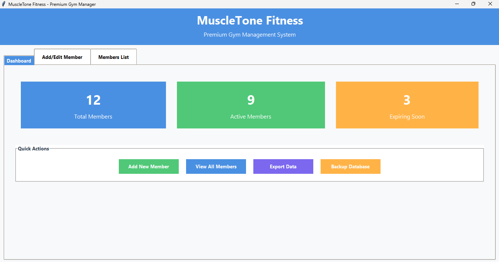
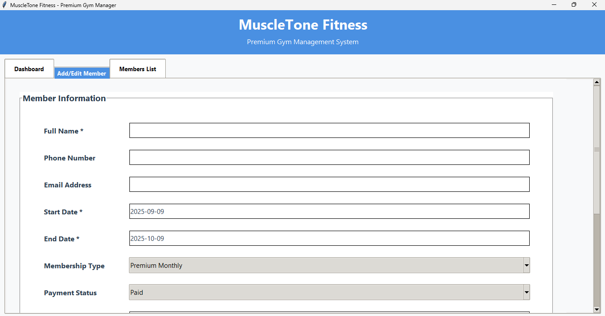
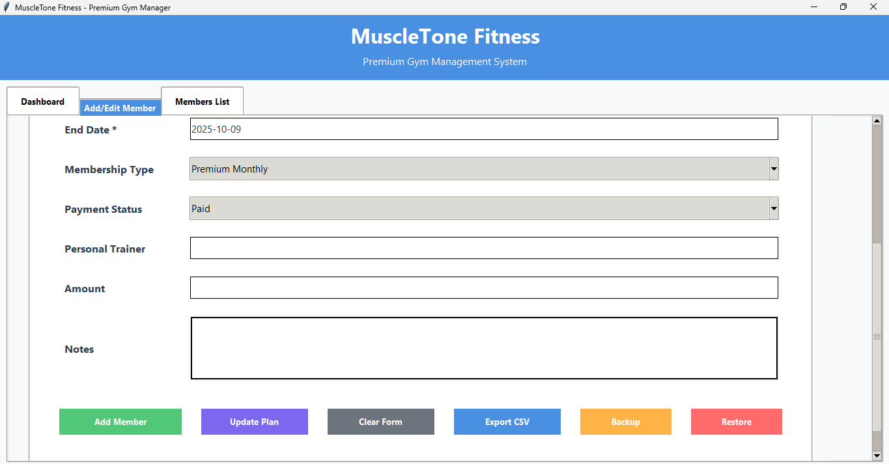
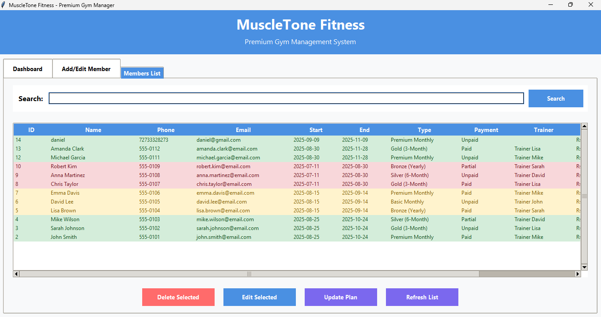
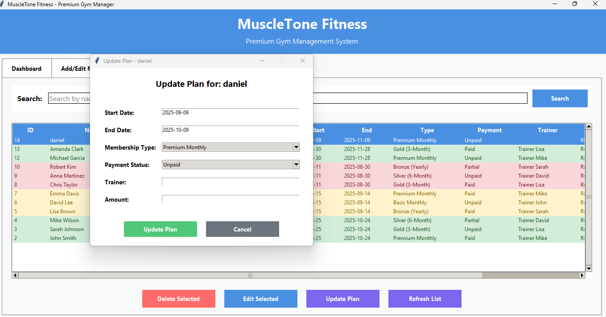
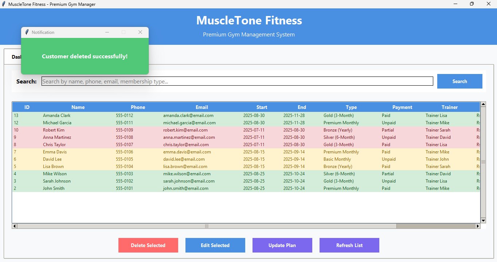
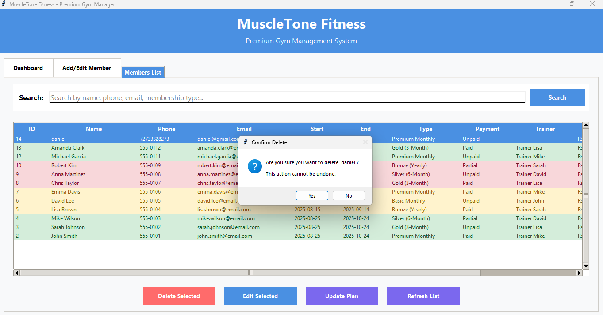
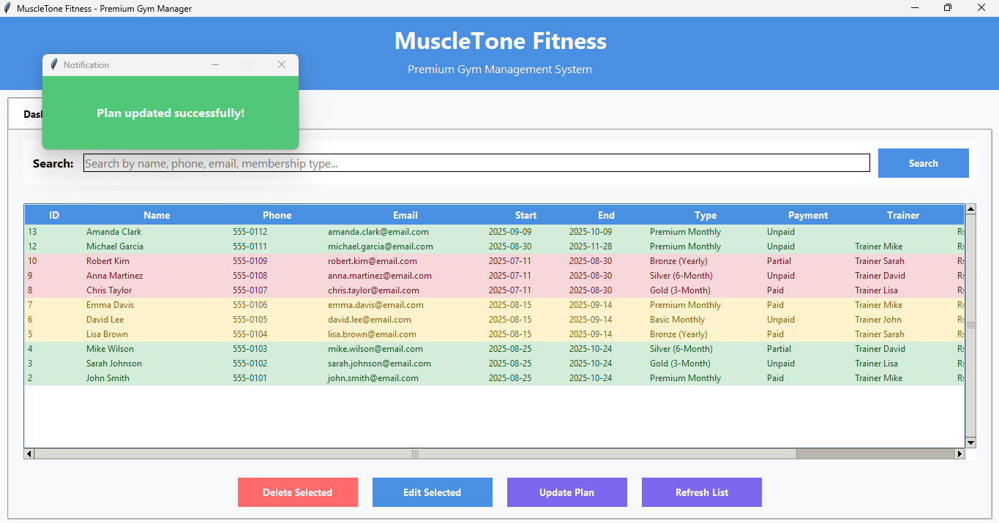

# MuscleTone Fitness – Gym Management System

**MuscleTone Fitness** is a **desktop Python application** using **Tkinter** that manages gym operations efficiently. It allows gym owners and trainers to manage members, track payments, update plans, and view statistics—all in a clean, user-friendly interface.

## Features

- **Member Management**: Add, edit, update, and delete member details.
- **Dashboard**: Quick overview of total and active members, payments due, and plan statuses.
- **Payment Tracking**: Monitor member payment status and due dates.
- **Data Export**: Export member lists to CSV for reporting.
- **Backup & Restore**: Secure data management.
- **Fully Desktop-Based**: No web or online dependencies required.

## Technologies Used

- Python
- Tkinter (GUI)
- SQLite (Database)
- CSV Handling (Data Export)
- FFMPEG / Media Player (Demo video preview)

## Screenshots & Demo

**Dashboard**  


**Add / Edit Member Pages**  
  


**Member List**  


**Update Plan / Delete Member**  
  
  
  


**Demo Video**  
[Watch Demo](assets/demo.mp4)

## Project Structure
GYM_APP/
├── code/
│ └── maingym.py
├── assets/
│ ├── dashboard.png
│ ├── addeditpage.png
│ ├── addeditpage2.png
│ ├── memberlist.png
│ ├── updateplan.png
│ ├── deletecustomer.png
│ ├── deleteconfirm.png
│ ├── updatecustomer.png
│ └── demo.mp4
├── README.md
├── requirements.txt
└── .gitignore


## Notes

- Screenshots and demo video are included for documentation and portfolio showcase.
- `.venv` or `venv` folders are **gitignored** to keep the repository clean.
- `sample_data.py` and `streamlit_app.py` are **not required** for the desktop version and can be ignored.

## Optional: Run Locally

If someone wants to run the app:

```bash
git clone https://github.com/sameer-cmd-git/GYM_APP.git
cd GYM_APP
python -m venv venv
# Windows
venv\Scripts\activate
# Linux / Mac
source venv/bin/activate
pip install -r requirements.txt
python code/maingym.py

